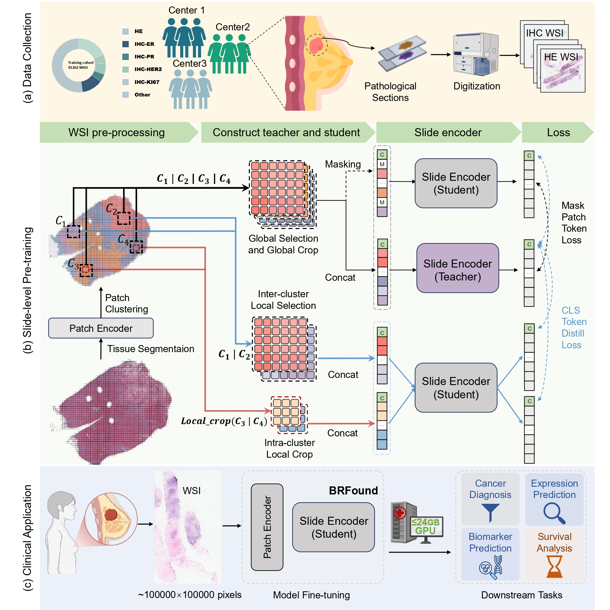

# BRFound

## A Clinically Feasible Whole Slide Foundation Model for Breast Oncology

[[`Model`](https://huggingface.co/Microgle/BRFound)] [[`Paper`]] 

Yuhao Wang, Fei Ren, Baizhi Wang*, Yunjie Gu, Qingsong Yao, Han Li, Fenghe Tang, Qingpeng Kong, Rongsheng Wang, Xin Luo, Zikang Xu, Yijun Zhou, Wei Ba, Xueyuan Zhang, Kun Zhang, Zhigang Song, Zihang Jiang, Xiuwu Bian, Rui Yan, S. Kevin Zhou* (*Cooresponding Author)

[](https://opensource.org/licenses/Apache-2.0)


### August 2025
- **Initial Model and Code Release**: We are excited toe release BRFound BRFound model and its code is now available. 
## Model Overview

<p align="center">
     <br>

  *Overview of BRFound model architecture*

</p>

## Install


1. Download our repository and open the BRFound
```
git clone https://github.com/wyh196646/BRFound
cd BRFound
```

2. Install BRFound and its dependencies

```Shell
conda env create -f environment.yaml
conda activate BRFound
pip install -e .
```

## Model Download

The BRFound models can be accessed from [HuggingFace Hub](https://huggingface.co/Microgle/BRFound).


## Inference with BRFound
During the model development process, we extensively referenced the open-source slide-level foundational model Gigapath. As a result, our data preprocessing steps are largely consistent with those of Gigapath. For more details, please refer to the [Gigapath](https://github.com/prov-gigapath/prov-gigapath.git) repository.


### Whole Slide Image Preprocessing

### Runing Inference with the Patch Encoder of BRFound
## Acknowledgements

We would like to express our gratitude to the authors and developers of the exceptional repositories that this project is built upon: GigaPath, Donov2 and UNI Their contributions have been invaluable to our work.

