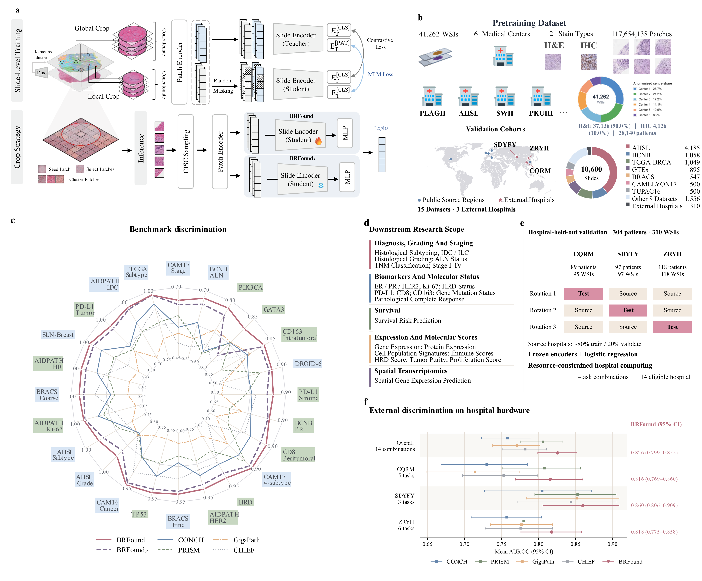

# BRFound

## A breast-specific slide-level foundation model for computational pathology

[[`Model`](https://huggingface.co/Microgle/BRFound)] [[`Paper`]] 

Yuhao Wang, Fei Ren, Baizhi Wang*, Yunjie Gu, Qingsong Yao, Han Li, Fenghe Tang, Qingpeng Kong, Rongsheng Wang, Xin Luo, Zikang Xu, Yijun Zhou, Wei Ba, Xueyuan Zhang, Kun Zhang, Zhigang Song, Zihang Jiang, Xiuhui Shi, Xiuwu Bian, Rui Yan, S. Kevin Zhou* (*Cooresponding Author)

[](https://opensource.org/licenses/Apache-2.0)


### October 2026
- Updated the manuscript overview and added a reproducible slide-inference command.
- Added `slide_encoder_inference.pth`: the epoch-161 teacher backbone exported as a
  plain tensor dictionary. It has the same parameters as the existing training checkpoint.

### August 2025
- **Initial Model and Code Release**: We are excited to release the pre-trained weights of BRFound and its inference code is now available. 
## Model Overview

<p align="center">
     <br>

  *Overview of BRFound model architecture*

</p>

## Install


1. Download our repository and open the BRFound
```
git clone https://github.com/wyh196646/BRFound
cd BRFound
```

2. Install BRFound and its dependencies

```Shell
conda env create -f environment.yaml
conda activate BRFound
pip install huggingface_hub
```

## Model Download

The weights of BRFound models can be accessed from [HuggingFace Hub](https://huggingface.co/Microgle/BRFound).


## Inference with BRFound
During the model development process, we extensively referenced the open-source slide-level foundational model Gigapath. As a result, our data preprocessing steps are largely consistent with those of Gigapath. For more details, please refer to the [Gigapath](https://github.com/prov-gigapath/prov-gigapath.git) repository.


### Whole Slide Image Preprocessing

### Runing Inference with the Patch Encoder of BRFound
```
import torch
from easydict import EasyDict
from torchvision import transforms
from PIL import Image
import sys
import os
from src import build_model_from_cfg
from src.vision_transformer import vit_base
from src.utils import load_pretrained_weights


def get_transform():
    return transforms.Compose([
        transforms.Resize(256, interpolation=transforms.InterpolationMode.BICUBIC),
        transforms.CenterCrop(224),
        transforms.ToTensor(),
        transforms.Normalize(mean=[0.485, 0.456, 0.406], std=[0.229, 0.224, 0.225]),
    ])


def extract_features(image_path, model, device='cuda'):
    transform = get_transform()

    image = Image.open(image_path).convert('RGB')
    image_tensor = transform(image).unsqueeze(0).to(device)

    with torch.no_grad():
        features = model(image_tensor)

    return features.cpu().numpy()

def build_model_for_eval(config, pretrained_weights):
    model, _ = build_model_from_cfg(config, only_teacher=True)
    load_pretrained_weights(model, pretrained_weights, "teacher")
    model.eval()
    model.cuda()
    return model

if __name__ == "__main__":
    
    config = EasyDict({
        'student': EasyDict({
            'arch': 'vit_base', 
            'patch_size': 16, 
            'drop_path_rate': 0.3,  
            'layerscale': 1.0e-05,  
            'drop_path_uniform': True,  
            'pretrained_weights': '',  
            'ffn_layer': 'mlp',  
            'block_chunks': 4,  
            'qkv_bias': True,  
            'proj_bias': True,  
            'ffn_bias': True,  
            'num_register_tokens': 0,  
            'interpolate_antialias': False,  
            'interpolate_offset': 0.1  
        }),
        'crops': EasyDict({
            'global_crops_size': 224,
        })    
    })
        
    weights_path = './weights/patch_encoder.pth'
    image_path = './images/patch_1.png'

    device = 'cuda' if torch.cuda.is_available() else 'cpu'
    print(f"Using device: {device}")
    
    # Check if files exist
    if not os.path.exists(weights_path):
        print(f"Warning: weights file not found at {weights_path}")
    if not os.path.exists(image_path):
        print(f"Warning: image file not found at {image_path}")
    
    # Only proceed if imports were successful and files exist

    model = build_model_for_eval(config, weights_path)
    features = extract_features(image_path, model, device=device)
    print(f"Extracted features shape: {features.shape}")
```

### Run inference with the slide encoder

Download the compact inference weights from
[Hugging Face](https://huggingface.co/Microgle/BRFound):

```python
from huggingface_hub import hf_hub_download

hf_hub_download(
    repo_id="Microgle/BRFound",
    filename="slide_encoder_inference.pth",
    local_dir="weights",
)
```

Prepare an HDF5 file containing `features` with shape `[N, 768]` from the BRFound
patch encoder and matching `coords` with shape `[N, 2]`. Coordinates are nonnegative
`(x, y)` pixel locations on the 256-pixel tile grid used during preprocessing.
Use the same coordinate scale as the training pipeline. This command accepts patch
features; WSI patch extraction is a separate preprocessing step.

```bash
python inference.py --features images/sample.h5 \
  --weights weights/slide_encoder_inference.pth \
  --output outputs/slide_embedding.npy --device cuda
```

Use `--device cpu` when CUDA is unavailable. The output is a NumPy array of shape
`[1, 768]`, suitable for a downstream prediction head. By default, inference uses
eight feature clusters, a 25% sampling ratio, a maximum of 4,000 tokens and seed 42.
These settings can be changed with `--clusters`, `--ratio`, `--max-tokens` and `--seed`.
The command checks feature dimensions, loads all backbone weights strictly, and computes
the original sinusoidal positions on demand to avoid allocating the full slide grid.

The original `patch_encoder.pth` and `slide_encoder.pth` remain available. The new
`slide_encoder_inference.pth` omits optimizer and pre-training-head state; it contains
the same teacher-backbone tensors. See `inference_config.json` on Hugging Face for
the source checkpoint epoch and SHA-256 checksums. The release was checked for strict
loading, repeatable CPU inference and agreement with the original positional encoding.

## Acknowledgements

We would like to express our gratitude to the authors and developers of the exceptional repositories that this project is built upon: GigaPath, Donov2 and UNI Their contributions have been invaluable to our work.

